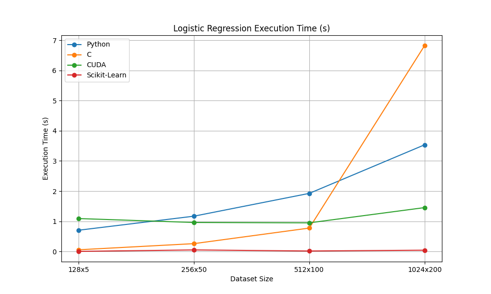
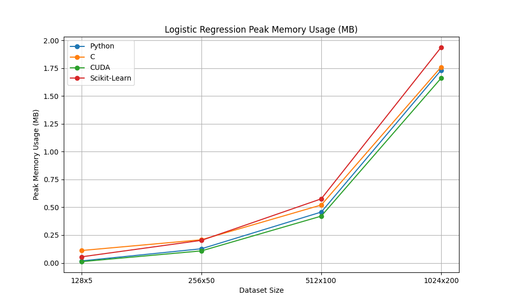

# Logistic Regression  

## Overview  

- Logistic regression is a **_supervised_** statistical model that attempts to map a set of input variables to an output class
- It is one of the most basic statistical models, built off of linear regression
- It is nearly fully linear, but a nonlinear sigmoid/softmax applied to linear logits
- Similar to linear regression, its simplicity and interpretability are its greatest strengths
- However, logistic regression has slightly fewer assumptions for use
- For my implementation, I used gradient descent rather than a numerical solver

## Mathematical Derivation

### Definition

Logistic regression is a statistical model used to predict the probability of a binary outcome based on one or more predictor variables.
It models the relationship between the probability of a binary outcome $`\Huge Y \in \{0, 1\}`$ and the independent variables $\Huge X$.

$$
\Huge \hat Y = \sigma(X\beta)
$$

where:

- $\Huge Y \in \mathbb{R}^{n \times 1}$ is the vector of observed values (with n samples and 1 output)
- $\Huge X \in \mathbb{R}^{n \times d}$ is the matrix of input features (with n samples and d-1 independent variables with a column of 1s to represent a bias)
- $\Huge \beta \in \mathbb{R}^{d \times 1}$ is the vector of regression coefficients (d independent variables/bias and 1 output)
- $\Huge \sigma$ is the sigmoid function $\Huge \sigma(X) = \frac{1}{1 + e^{-X}}$

### Multiclass definition

Logistic regression is natively for binary classification, but can be modified for multiclass with a few differences:

$$
\Huge Y = S(X\beta)
$$

- $\Huge Y \in \mathbb{R}^{n \times c}$ a one-hot matrix (row-wise) of observed values (with n samples and c classes)
- $\Huge \beta \in \mathbb{R}^{d \times c}$ is the vector of regression coefficients (d independent variables/bias and c classes)
- $\Huge S$ is the softmax function $\Huge S(X_i) = \frac{e^{x_i}}{\sum_{j=1}^{c}e^{x_j}}$

### Loss function

To estimate $\Huge \beta$, we minimize the error between the predicted and true probability distribution:

- **Binary:**

$$
\Huge \mathcal{L}(\beta) = -\frac{1}{n} \sum_{i=1}^n Y_i*\log(\hat Y_i) + (1 - Y_i)*\log(1 - \hat Y_i)
$$

- **Multiclass:**

$$
\Huge \mathcal{L}(\beta) = -\frac{1}{n} \sum_{i=1}^n \sum_{j=1}^c Y_{ij}*\log(\hat Y_{ij})
$$

This is referred to as cross entropy, or CE.

### Gradient

While logistic regression is linear with regards to the parameters, the sigmoid/softmax activation functions add nonlinearity, resulting in no closed-form solution.
Therefore, an iterative method such as gradient descent is required to compute the optimal weights. Gradient descent is defined below as such:

$$
\Huge \Theta = \Theta - \alpha * \nabla L(\Theta)
$$

Where:
- $\Huge \Theta$ is the model paramters
- $\Huge \alpha$ is the learning rate
- $\Huge \nabla L(\Theta)$ is the gradient of the loss function with respect to the model parameters

For logistic regression, the gradient of the loss function can be derived as such:

$$
\Huge \mathcal{L}(\beta) = -\frac{1}{n} \sum_{i=1}^n Y_i*\log(\hat Y_i) + (1 - Y_i)*\log(1 - \hat Y_i)
$$

$$
\Huge \mathcal{L}(\beta) = -\frac{1}{n} \sum_{i=1}^n Y_i*\log(\sigma (X\beta)) + (1 - Y_i)*\log(\sigma (X\beta))
$$

Then we differentiate with respect to $\Huge \beta$ with the knowledge that $\Huge \sigma'(x) = \sigma(x)(1-\sigma(x))$

$$
\Huge \nabla \mathcal{L}(\beta) = 
-\frac{1}{n} \sum_{i=1}^n 
Y_i \cdot \frac{\sigma(X_i\beta) \cdot (1-\sigma(X_i\beta)) \cdot X_i}{\sigma(X_i\beta)} + 
(Y_i - 1) \cdot \frac{\sigma(X_i\beta) \cdot (1-\sigma(X_i\beta)) \cdot X_i}{1-\sigma(X_i\beta)}
$$

$$
\Huge \nabla \mathcal{L}(\beta) = 
-\frac{1}{n} \sum_{i=1}^n 
Y_i \cdot (1-\sigma(X_i\beta)) \cdot X_i + 
(Y_i - 1) \cdot \sigma(X_i\beta) \cdot X_i
$$

$$
\Huge \nabla \mathcal{L}(\beta) = 
-\frac{1}{n} \sum_{i=1}^n X_i \cdot (
Y_i \cdot (1-\sigma(X_i\beta)) + 
(Y_i - 1) \cdot \sigma(X_i\beta)
)
$$

$$
\Huge \nabla \mathcal{L}(\beta) = 
-\frac{1}{n} \sum_{i=1}^n X_i \cdot (
Y_i - Y_i \cdot \sigma(X_i\beta) + 
Y_i \cdot \sigma(X_i\beta) - \sigma(X_i\beta)
)
$$

$$
\Huge \nabla \mathcal{L}(\beta) = 
-\frac{1}{n} \sum_{i=1}^n X_i \cdot (
Y_i - \sigma(X_i\beta)
)
$$

$$
\Huge \nabla \mathcal{L}(\beta) = 
-\frac{1}{n} \sum_{i=1}^n X_i \cdot (
Y_i - \hat Y_i
)
$$

Or in matrix form,

$$
\Huge \nabla \mathcal{L}(\beta) = X^T \cdot (Y - \hat Y)
$$

This derivation will allow us to make optimal steps towards the optimal weights.
For the multiclass case, the result is the same.

### Predictions

Once we have $\Huge \hat{\beta}$, predictions for new data $\Huge X_{\text{new}}$ can be made as:

$$
\Huge \hat Y = \sigma(X_{\text{new}} \hat{\beta})
$$

or

$$
\Huge \hat Y = S(X_{\text{new}} \hat{\beta})
$$

in the multiclass case.

## Assumptions  

Logistic regression has a few notable assumptions that should be checked before use:

- **Binary/Ordinal Output Variable:** The output classes should be binary/ordinal
- **Independence of Observations:** Observations should be independent of each other
- **No multicollinearity:** Input variables should not correlate (r statistic)
- **Linearity of Inputs and Log-Odds:** A linear relationship should exist between the inputs and the Log-Odds

## Strengths and Weaknesses  

### Strengths  

- Simple and interpretable  
- Computationally efficient
- Probabilistic output
- Feature importance
- Robust to noise

### Weaknesses  

- Sensitive to outliers  
- Assumes a linear relationship  
- Assumes independent features
- Requires a large sample size

## Implementation Details  

Some specifics to keep in mind for this implementation:

- Floats were used as the data type for a balance between speed and precision (float in C/C++/CUDA, np.float32 in Python)
- I only stepped one layer of abstraction below logistic regression, using optimized subroutines such as cuBLAS with some of my own kernels
- I used ctypes to create wrapper classes around the C/CUDA functions
- Type and value checking is handled in the base classes
- Implemented as a child class of linear regression

## Benchmarking & Performance  

## Thoughts & Ideas  

- The C/CUDA programming was much quicker this time than for linear regression
- I have improved my ability to work with the column-major constraint of cuBLAS
- This time, my classes are clearly slower than SKLearn, likely due to SKLearn using a numerical solver rather than gradient descent
- At scale, I expect my CUDA logistic regression to be faster
