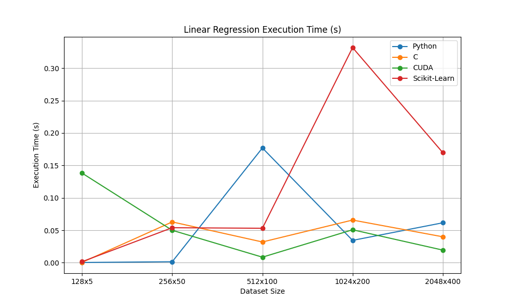
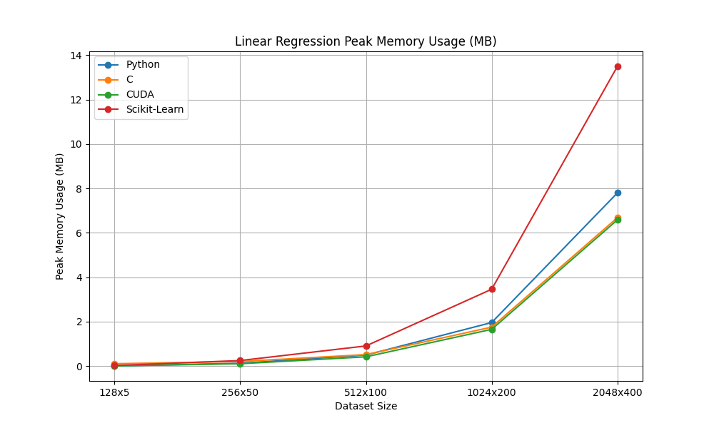

# Linear Regression  

## Overview  

- Linear regression is a **_supervised_** statistical model that attempts to map a set of input variables to a set of output variables
- It is one of the most basic statistical models, so much so that it is disputed whether it counts as "machine learning"
- As a fully linear method, it is unable to model many real-world relationships
- However, its simplicity, interpretability, and efficiency more than make up for this drawback as long as key assumptions are met
- It is arguably the basis of all machine learning
- For my implementation, I used the closed-form solution that I will derive below rather than gradient descent because I find it very cool that such a solution exists and I wanted to implement it

## Mathematical Derivation

### Definition

A linear regression model assumes a linear relationship between the dependent variables $\Huge Y$ and the independent variables $\Huge X$:

$$
\Huge Y = X\beta
$$

where:

- $\Huge Y \in \mathbb{R}^{n \times m}$ is the vector of observed values (with n samples and m dependent variables)
- $\Huge X \in \mathbb{R}^{n \times d}$ is the matrix of input features (with n samples and d-1 independent variables with a column of 1s to represent a bias)
- $\Huge \beta \in \mathbb{R}^{d \times m}$ is the vector of regression coefficients (d independent variables/bias and m dependent variables)

### Loss function

To estimate $\Huge \beta$, we minimize the sum of squared errors:

$$
\Huge \mathcal{L}(\beta) = \frac{1}{n} \sum_{i=1}^{n} \sum_{j=1}^{m} (Y_{ij} - (X\beta)_{ij})^2
$$

or, in matrix form where $\\Vert \cdot \\Vert_F$ denotes the frobenius norm:

$$
\Huge \mathcal{L}(\beta) = \frac{1}{n}\\Vert Y - X \beta \\Vert_F^2
$$

This is referred to as mean squared error, or MSE.

### Closed-Form Solution

Miraculously, since linear regression is an entirely linear model, there exists a closed-form solution for $$\Huge \beta$$ which I will derive below:  

$$
\Huge \mathcal{L}(\beta) = \frac{1}{n}\\Vert Y - X \beta \\Vert_F^2  
$$

Without getting too deep into the linear algebra:

$$
\Huge \nabla_\beta\mathcal{L}(\beta) = \frac{2}{n}X^T(Y - X\beta)
$$

Now we set equal to 0 to minimize the loss:

$$
\Huge 0 = \frac{2}{n}X^T(Y - X\beta)
$$

$$
\Huge 0 = X^T(Y - X\beta)
$$

$$
\Huge 0 = X^TY - X^TX\beta
$$

$$
\Huge X^TX\beta = X^TY
$$

$$
\Huge \beta = (X^TX)^{-1}X^TY
$$

It is worth noting that if $\Huge X^TX$ is not invertible, then the Moore-Penrose pseudoinverse should be used.

### Pseudoinverse

For matrices that aren't invertible (correlated columns being the most likely reason here), the Moore-Penrose pseudoinverse is applicable, defined as:

$$
\Huge A^+ = V\Sigma^+U^T
$$

Where $\Huge V$, $\Huge \Sigma$, and $\Huge U^T$ are computed by taking the singular value decomposition (SVD) of A:

$$
\Huge A = U \Sigma V^T
$$

To get $\Huge \Sigma^+$ simply tranpose $\Huge \Sigma$ and invert the singular values.

### Predictions

Once we have $\Huge \hat{\beta}$, predictions for new data $\Huge X_{\text{new}}$ can be made as:

$$
\Huge \hat{Y} = X_{\text{new}} \hat{\beta}
$$

## Assumptions  

Linear regression has a few notable assumptions that should be checked before use:

- **Linearity of relationships:** A linear relationship should exist (Lack-of-Fit Test)
- **Normally Distributed Variables:** Inputs should be multivariate normal (Q-Q plot)
- **Independence of errors:** Model errors should not correlate (Durbin-Watson statistic)
- **Homoscedasticity:** Model errors should be constant (Levene’s test)
- **No multicollinearity:** Input variables should not correlate (r statistic)

## Strengths and Weaknesses  

### Strengths  

- Simple and interpretable  
- Computationally efficient  
- Works well with small datasets

### Weaknesses  

- Sensitive to outliers  
- Assumes a linear relationship  
- Can suffer from overfitting with high-dimensional data  

## Implementation Details  

Some specifics to keep in mind for this implementation:

- Floats were used as the data type for a balance between speed and precision (float in C/C++/CUDA, np.float32 in Python)
- I only stepped one layer of abstraction below linear regression, I used C libraries like CBLAS and LAPACKE and CUDA libraries like cuBLAS and cuSOLVER
- For modularity, host-side data is handled in C++ and device-side data is handled in CUDA alongisde kernels I write
- I used ctypes to create wrapper classes around the C/C++/CUDA functions
- Type and value checking is handled in the base classes

## Benchmarking & Performance  

## Thoughts & Ideas  

- I found it fascinating that linear regression has a closed-form solution and I'm happy I was able to derive it.
- It is worth noting that the C class is clearly slower than the others at scale, I found this to be because of SVD computation and lack of multiprocessing.
- Coding this up has been a good exercise in created shared C/C++/CUDA libraries, which is likely what I spent the most time on.
- I will code up logistic regression next, it should work well as a child class of this.
